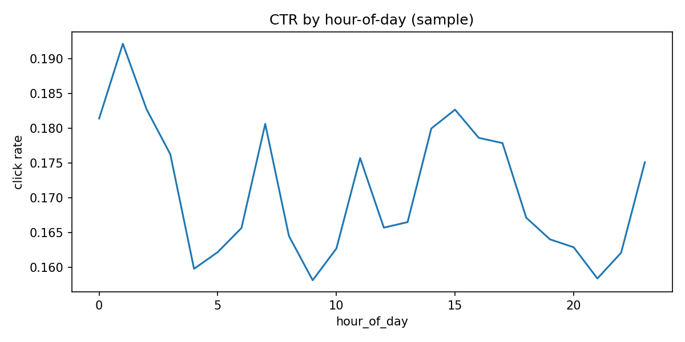
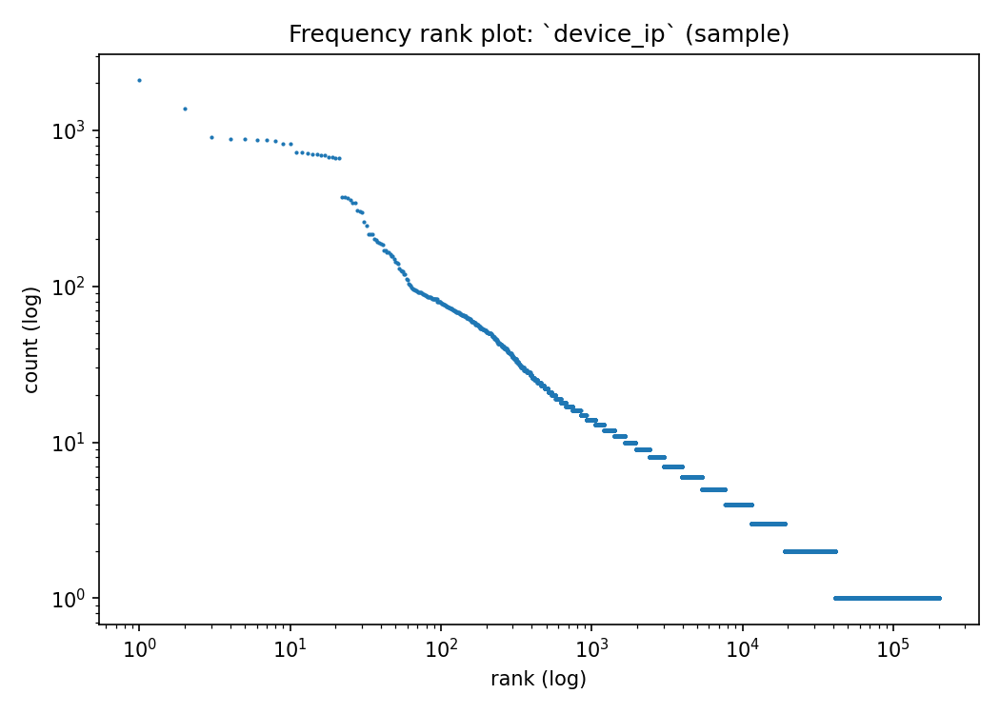
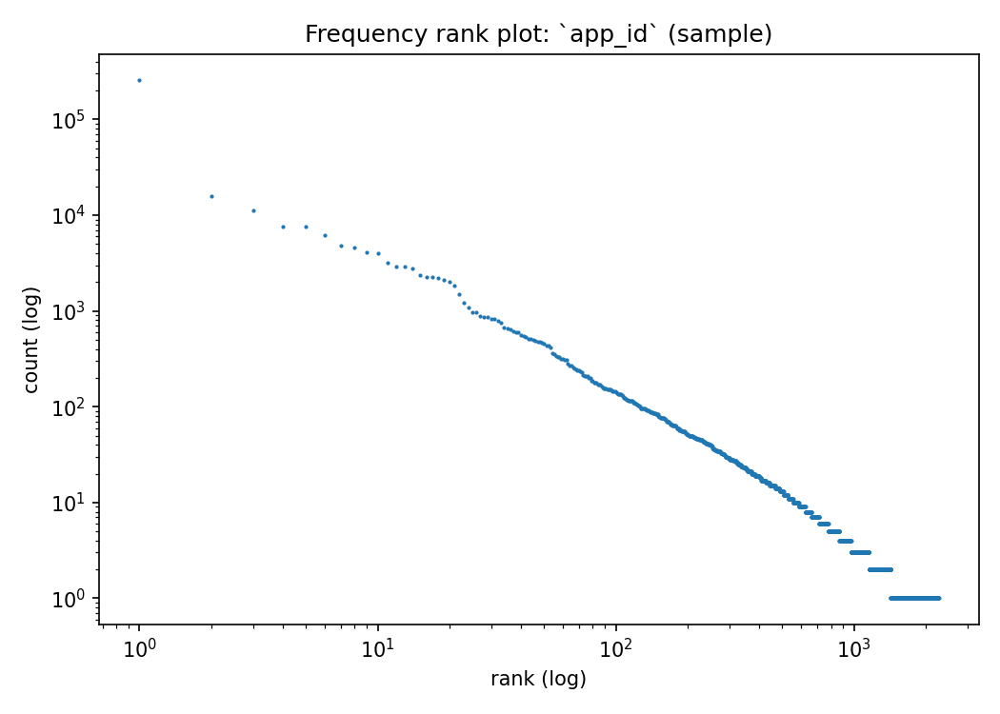

# Avazu CTR — EDA Report (sample-based)

This report is generated from a deterministic subsample to keep iteration fast and preserve time structure.

## Dataset snapshot
- Sample parquet: `data/interim/train_sample.parquet`
- Rows: `403,698`
- Overall CTR: `0.1705`
- Time range: `2014-10-21 00:00:00` → `2014-10-30 23:00:00`
- Distinct days / hours: `10` / `240`

## OOT splits (by day)
| split | rows | min hour_dt | max hour_dt |
| --- | --- | --- | --- |
| train | 323,612 | 2014-10-21 00:00:00 | 2014-10-28 23:00:00 |
| val | 38,152 | 2014-10-29 00:00:00 | 2014-10-29 23:00:00 |
| test | 41,934 | 2014-10-30 00:00:00 | 2014-10-30 23:00:00 |

## Target behavior over time

## Categorical cardinality + concentration
High-cardinality columns are important for TE and entity-history features, but also drive cold-start in OOT splits.

| col | nunique | top1_share | top10_share |
| --- | --- | --- | --- |
| device_ip | 262291 | 0.005 | 0.026 |
| device_id | 65087 | 0.824 | 0.826 |
| device_model | 4378 | 0.060 | 0.243 |
| app_id | 2264 | 0.638 | 0.801 |
| site_domain | 2152 | 0.375 | 0.741 |
| site_id | 2148 | 0.362 | 0.701 |
| C14 | 2062 | 0.023 | 0.177 |
| C17 | 413 | 0.112 | 0.341 |
| C20 | 160 | 0.468 | 0.795 |
| app_domain | 146 | 0.673 | 0.968 |
| C19 | 66 | 0.301 | 0.786 |
| C21 | 60 | 0.220 | 0.772 |
| app_category | 26 | 0.647 | 0.998 |
| site_category | 20 | 0.410 | 0.998 |
| C16 | 9 | 0.943 | 1.000 |
| C15 | 8 | 0.933 | 1.000 |
| C1 | 7 | 0.918 | 1.000 |
| banner_pos | 7 | 0.721 | 1.000 |
| device_type | 5 | 0.923 | 1.000 |
| device_conn_type | 4 | 0.863 | 1.000 |

## Long-tail structure (frequency rank plots)

## Cold-start (unseen categories in val/test vs train)
This estimates how often a category value appears in val/test that never appears in train (on this sample).

| col | val_unseen_rate | test_unseen_rate |
| --- | --- | --- |
| device_ip | 0.641 | 0.734 |
| C14 | 0.237 | 0.360 |
| C17 | 0.236 | 0.335 |
| device_id | 0.195 | 0.148 |
| C21 | 0.013 | 0.194 |
| C19 | 0.016 | 0.107 |
| app_id | 0.005 | 0.007 |
| site_id | 0.002 | 0.004 |
| device_model | 0.004 | 0.004 |
| site_domain | 0.002 | 0.003 |
| app_domain | 0.000 | 0.000 |
| C20 | 0.000 | 0.000 |
| app_category | 0.000 | 0.000 |
| C16 | 0.000 | 0.000 |
| C15 | 0.000 | 0.000 |
| C1 | 0.000 | 0.000 |
| C18 | 0.000 | 0.000 |
| banner_pos | 0.000 | 0.000 |
| device_conn_type | 0.000 | 0.000 |
| site_category | 0.000 | 0.000 |

## CTR by popular categories (top-K)
### `app_id`
| app_id | imps | ctr |
| --- | --- | --- |
| ecad2386 | 257679 | 0.2000 |
| 92f5800b | 15642 | 0.0217 |
| e2fcccd2 | 11321 | 0.1943 |
| 9c13b419 | 7562 | 0.3086 |
| febd1138 | 7519 | 0.0451 |
| 7358e05e | 6173 | 0.1809 |
| a5184c22 | 4802 | 0.2507 |
| d36838b1 | 4590 | 0.0702 |
| 685d1c4c | 4082 | 0.0713 |
| 54c5d545 | 3956 | 0.1360 |
| 03528b27 | 3193 | 0.1369 |
| e2a1ca37 | 2907 | 0.1359 |
| f0d41ff1 | 2874 | 0.0588 |
| e9739828 | 2777 | 0.0284 |
| 51cedd4e | 2360 | 0.0487 |

### `site_id`
| site_id | imps | ctr |
| --- | --- | --- |
| 85f751fd | 146019 | 0.1185 |
| 1fbe01fe | 64823 | 0.2091 |
| e151e245 | 26386 | 0.2969 |
| d9750ee7 | 9610 | 0.2774 |
| 5b08c53b | 9056 | 0.4696 |
| 5b4d2eda | 7576 | 0.1295 |
| 856e6d3f | 7569 | 0.0374 |
| a7853007 | 4625 | 0.1075 |
| b7e9786d | 3675 | 0.0765 |
| 6399eda6 | 3463 | 0.1152 |
| 5ee41ff2 | 3422 | 0.3451 |
| 5bcf81a2 | 3419 | 0.1065 |
| 6256f5b4 | 3138 | 0.1769 |
| 57ef2c87 | 3078 | 0.1283 |
| 17caea14 | 2812 | 0.2440 |

### `site_domain`
| site_domain | imps | ctr |
| --- | --- | --- |
| c4e18dd6 | 151357 | 0.1225 |
| f3845767 | 64823 | 0.2091 |
| 7e091613 | 33301 | 0.2597 |
| 7687a86e | 12687 | 0.4620 |
| 98572c79 | 9924 | 0.2726 |
| 16a36ef3 | 8409 | 0.1437 |
| 58a89a43 | 7569 | 0.0374 |
| 9d54950b | 3782 | 0.1029 |
| b12b9f85 | 3722 | 0.0776 |
| 17d996e6 | 3467 | 0.3421 |
| 968765cd | 3463 | 0.1152 |
| 28f93029 | 3138 | 0.1769 |
| bd6d812f | 3078 | 0.1283 |
| d262cf1e | 2920 | 0.0199 |
| 0dde25ec | 2812 | 0.2440 |

### `app_domain`
| app_domain | imps | ctr |
| --- | --- | --- |
| 7801e8d9 | 271770 | 0.1962 |
| 2347f47a | 52478 | 0.1376 |
| ae637522 | 18886 | 0.0257 |
| 5c5a694b | 11324 | 0.1943 |
| 82e27996 | 7519 | 0.0451 |
| d9b5648e | 7274 | 0.1112 |
| 0e8616ad | 6639 | 0.0676 |
| b9528b13 | 6487 | 0.1747 |
| b8d325c3 | 5244 | 0.2334 |
| aefc06bd | 2978 | 0.0745 |
| df32afa9 | 2839 | 0.0282 |
| 33da2e74 | 2523 | 0.1185 |
| 6f7ca2ba | 2265 | 0.2384 |
| 5b9c592b | 1084 | 0.0609 |
| 5c620f04 | 618 | 0.0340 |

### `device_model`
| device_model | imps | ctr |
| --- | --- | --- |
| 8a4875bd | 24403 | 0.1401 |
| 1f0bc64f | 14320 | 0.2272 |
| d787e91b | 14149 | 0.2252 |
| be6db1d7 | 7487 | 0.1926 |
| 76dc4769 | 7433 | 0.1920 |
| 7abbbd5c | 6511 | 0.1700 |
| 4ea23a13 | 6501 | 0.2083 |
| a0f5f879 | 6423 | 0.1650 |
| ecb851b2 | 6113 | 0.1801 |
| d4897fef | 4749 | 0.1708 |
| 5096d134 | 4729 | 0.1711 |
| 711ee120 | 4576 | 0.2194 |
| 1ccc7835 | 4255 | 0.1767 |
| e1eae715 | 4213 | 0.0214 |
| c6263d8a | 3913 | 0.2476 |

## Modeling implications (for this repo)
- OOT drift is visible (CTR and volume vary by day); keep strict chronological splits for selection.
- High-cardinality columns have long tails; TE (with time-aware shifting) is a compact baseline.
- Entity history features (Family A) help because they summarize recent behavior while respecting the online constraint.

## Reproducibility
Regenerate this report via:

- `python human_src/generate_eda_report.py --sample-parquet data/interim/train_sample.parquet --out-md docs/EDA_REPORT.md`

